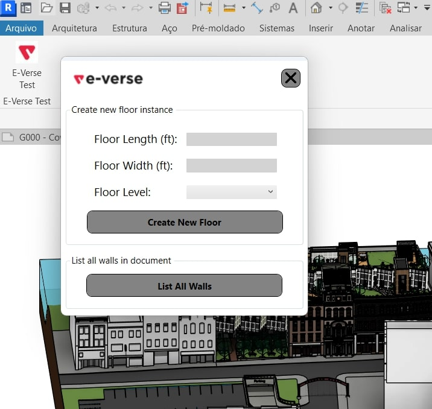

## Description

This is Mariana Menezes' source code for E-Verse's requested technical test. The installer can be found in the release attachments of this repository or inside the 'Output' folder. It's named 'EVerseTechTestApp 1.0.0.exe'.

This solution is designed to work with Revit 2024. It is composed of two simple features: 'Create Floor' and 'List All Walls'. 'Create Floor' generates a simple rectangular floor from an available floor type in the document according to user inputs for length, width, and level. 'List All Walls' lists the number of walls instantiated in the document and how many instances there are of each wall type.

## Development

The selected tasks were to develop 'Create Floor' and 'List All Walls' features. 'Create Floor' required developing 3 interface inputs (floor width, floor length and desidered instancing level) to instance a simple rectangular floor.
'List All Walls' required creating a FilteredElementCollector that filtered all wall instances and composing a message that states how many wall instances are present in the document and their wall types.

## Possible improvements

Possible improvements for 'Create Floor' could include adding a ComboBox dropdown to display available floor types in the document so the user can select which floor type they want to instantiate. It would also be possible to determine which length unit is used in the document and apply it to the new floor dimensions instead of exclusively using feet as the length unit.
Both 'Create Floor' and 'List All Walls' could hide/isolate created/filtered elements so the user could verify them.
